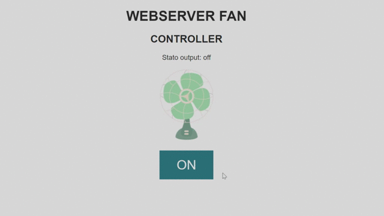

# WEBSERVER_FAN-CONTROLLER




## Introduzione

Lo sketch (compatibile con schede basate su ESP8266)
si occupa di hostare un webserver 
che permette di controllare una ventola a distanza.
> Per accedere al web server lo sketch si connette ad una rete WiFi

## Guida all'uso

1. Modificare ssid (variabile ```ssid```) e password (variabile ```password```) nella sezione variabili
   per farle corrispondere a quelle della rete WiFi
   a cui la scheda si connettera'
2. Modificare il pin su cui effettuare l'attuazione (variabile ```outPin```)
3. Se desiderato e' possibile modificare lo stile CSS (variabili ```htmlCSS```, ```btnCSS```,```offBtnCSS```,```onBtnCSS```)
   e/o le immagini/gif (variabili ```onImg```, ```offImg```)
> Attenzione: se si desidera modificare le immagini occorre trovare immagini di dimensioni ridotte
> e ottimizzarle per occupare meno risorse possibili alla scheda. In caso contrario lo sketch potrebbe
> non compilarsi.
4. Attenersi alle istruzioni del costruttore della scheda per scegliere le impostazioni
   per poter caricare lo sketch sulla scheda.
5. Caricare lo sketch sulla scheda e aprire la seriale: apparira' l'ip da utilizzare per accedere al web server.
> Nota: se si imposta la variabile ```boolDebug``` a false l'ip non verra' visualizzato su seriale, occorrera'
> utilizzare un software per analizzare la rete per rilevare il dispositivo.

## Descrizione
Per la descrizione del codice visitare la pagina
di documentazione generata da Doxygen [cliccando qui]()

## Requisiti
* Arduino IDE configurato per caricare sketch su schede basate su ESP8266
* dispositivo da attuare (ventola, led,...)

## Changelog

**2020-04-02 01_01:** <br>
Primo commit

## Autori
* Morini Martino
* Fraccari Luca
* Zenaro Stefano